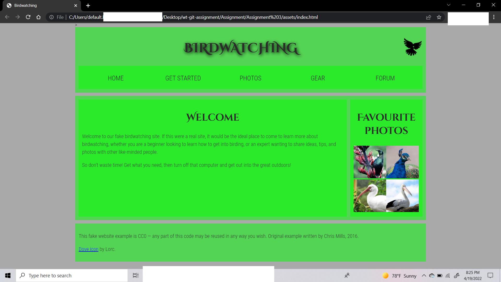
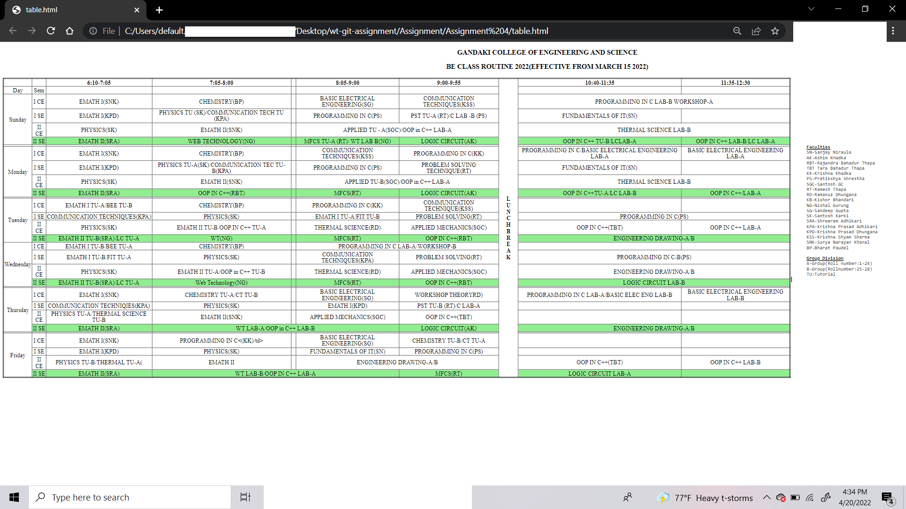
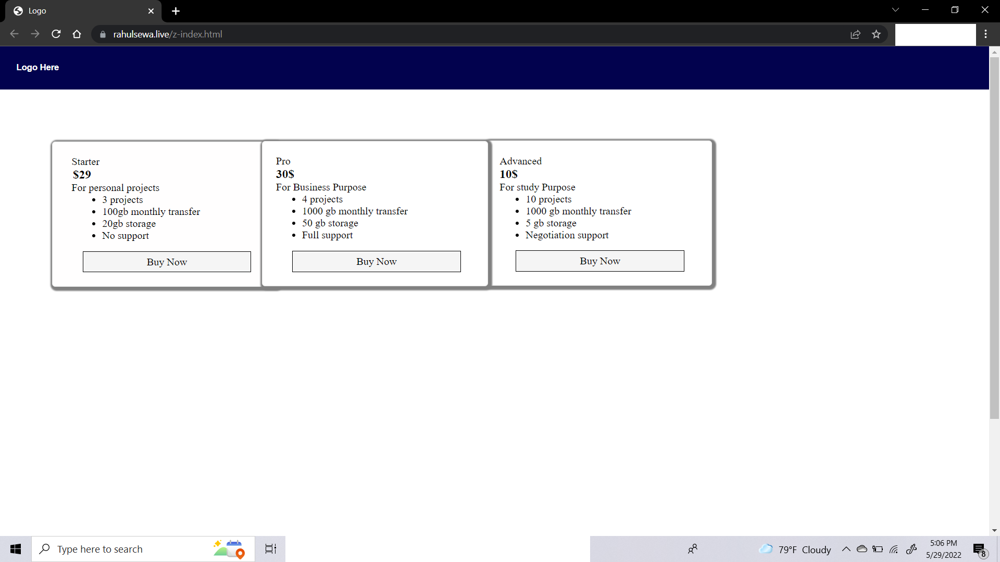

Assignment 1 Getting the domain name 
Assignment 2 Adding pages to the Hosted website 
Assignment 3 Bird Watching 

 
 
Assignment 4 Routine 

 
 
Assignment 5 Z-index 

[Z-index] (https://rahulsewa.live/z-index.html)
 
[Project Website] (https://rahulsewa.live)
 
[Drag and drop] (https://rahulsewa.live/Assignment%207/dragandrop.html)
 
 
 
<b>Creating Local Host - (Assignment 8[2022/6/19-20(7:00 AM)])</b>
 
   Step 1- Installation Of XAMPP(There are many btw..can be done using any)
   Step 2-
           (In xampp) 
           {
             
              (In htdocs)
               
              {
                 
                create 2 folders
                 
                1)hello (inside hello index.php)
                 
                1)second (inside second index.php)
                 
              }
               
           } 
            
        

   Step 2- In xampp {
     
            (In apache){
                 
               (In conf)
                 
               {
                 
                (In extra){
                     
                   In httpd-vhosts-
                     
                    <VirtualHost *:80>
                     DocumentRoot "C:\xampp\htdocs\github\wt-git-assignment\Assignment\Assignment 8\hello"
                     ServerName hello.local
                    </VirtualHost>  

                    <VirtualHost *:80>
                     DocumentRoot "C:\xampp\htdocs\github\wt-git-assignment\Assignment\Assignment 8\hello"
                     ServerName second.local
                    </VirtualHost> 
                }
               }
            } 
   Step 3-
   { 
     
     (In C drive) 
      { 
        (In Windows) 
          { 
            (System 32) 
              { 
                drivers - 
                etc - 
                hosts- 
                127.0.0.1    hello.local 
                127.0.0.1    second.local 
             } 
          } 
        } 
      } 
    } 
Step 4-
        Open XAMPP 
        Start apache server 
        Goto browser 
        type 
        http://hello.local 
        http://second.local 

 

Apache Server-
Apache Xampp is an open source tool used for running PHP or PERL Web applications locally using a Web server. It is available for all major operating systems and is popular with Windows users to locally build and test their Web apps. In this tutorial, we will explore how to get started with Xampp. In the process, we shall create and run our own Web application in PHP, and use MySQL databases with the help of the PHPMyAdmin tool.

Xampp is a free and open source cross-platform Web server solution stack package developed by Apache Friends. It comes loaded with an Apache HTTP server, MariaDB, and MySQL. It also has interpreters for the programming languages PHP and PERL. Xampp is one of the most popular solutions for running PHP apps locally on Windows. Pronounced as Shamp, it is an abbreviation for ‘cross-platform MySQL PHP and Perl’.

