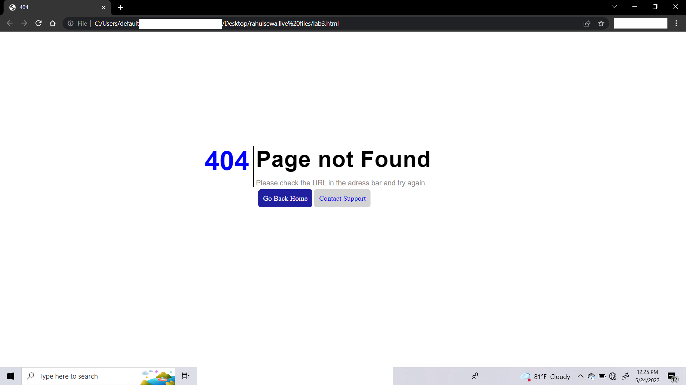
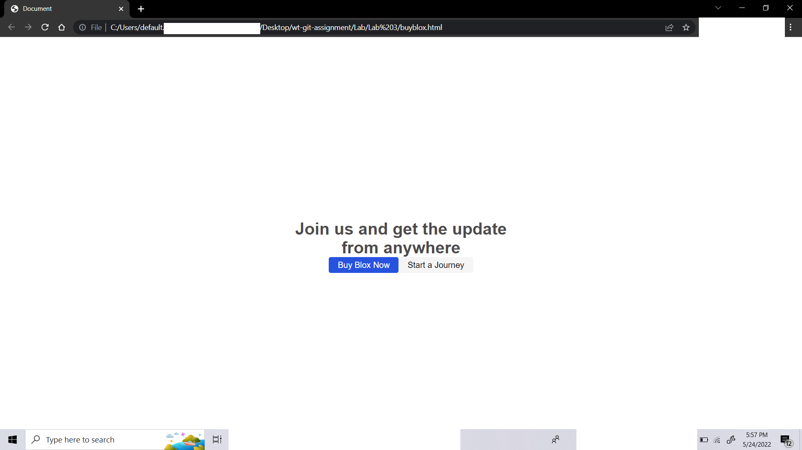

[404 Not Found] (https://rahulsewa.live/lab3.html)
 
[BuyBlox](https://rahulsewa.live/buyblox.html)
 
Date: 22 May 2022
 
Theory
Display

The display CSS property sets whether an element is treated as a block or inline element and the layout used for its children, such as flow layout, grid or flex.
Formally, the display property sets an element's inner and outer display types. The outer type sets an element's participation in flow layout; the inner type sets the layout of children. Some values of display are fully defined in their own individual specifications; for example the detail of what happens when display: flex is declared is defined in the CSS Flexible Box Model specification.

display: inline-block;  //The element generates a block element box that will be flowed with surrounding content as if it were a single inline box (behaving much like a replaced element would).
display: inline; // The element generates a block element box that will be flowed with surrounding content as if it were a single inline box (behaving much like a replaced element would).
display: block;   //The element generates a block element box, generating line breaks both before and after the element when in the normal flow.
display: flex;  //The element behaves like an inline element and lays out its content according to the flexbox model.

The Button element
The <button> HTML element is an interactive element activated by a user with a mouse, keyboard, finger, voice command, or other assistive technology. Once activated, it then performs a programmable action, such as submitting a form or opening a dialog.

By default, HTML buttons are presented in a style resembling the platform the user agent runs on, but you can change buttons' appearance with CSS.

 

